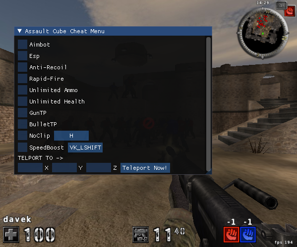
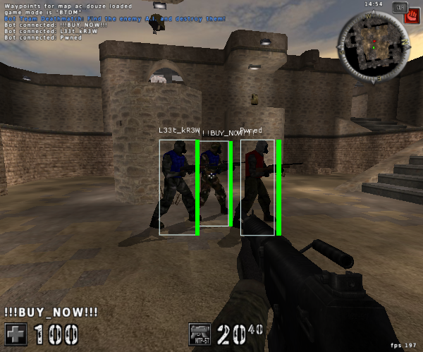

# <span style="color:#99ccff;">AssaultCube Cheats</span>
I built this project to enhance my C++ programming, reverse engineering, debugging, and memory management skills, while also gaining a deeper understanding of how Windows applications function. By diving deep into memory manipulation, I practiced reverse engineering techniques like function hooking and game logic analysis using IDA Pro. By reversing the AssaultCube executable with IDA and Cheat Engine, I was able to dissect the game and create cheats.

## <span style="color:#99ccff;">Features</span>
- **Aimbot**: Automatically aim at enemies for more accurate shots.
- **ESP (Extra Sensory Perception)**: Highlights enemies through walls, displays PlayerName & Health.
- **Anti-Recoil**: Eliminates weapon recoil.
- **Rapid-Fire**: Makes Bullets shoot instantly after one another.
- **Unlimited Ammo**: Provides infinite ammunition.
- **Unlimited Health**: Provides infinite health.
- **GunTP**: Teleports the player to wherever the player shot.
- **BulletTP**: Teleports all bullets shot from the player to the enemey regardless of where the player is standing.
- **NoClip**: Allows the player to fly through walls and obstacles, activated via a customizable hotkey.
- **SpeedBoost**: Increases player movement speed, activated via a customizable hotkey.
- **Teleport to Coordinates**: Allows teleportation to specific coordinates (X, Y, Z) entered by the user.

## <span style="color:#99ccff;">Screenshots</span>




## <span style="color:#99ccff;">Build Instructions</span>

To build this project, follow these steps:

*Side Note: The ESP is setup to work on 600px width and 500px height window size. If you're using different resolution change it in the source code*

1. **Clone the repository**  
   First, clone the repository to your local machine using the following command:
   ```bash
   git clone <repository_url>
   ```

2. **Open the solution**  
   Navigate to the project folder and open the solution file (`.sln`) in Visual Studio.

3. **Build the AssaultCubeInjector**  
   First Select Release Mode and x86, then Right-click on the project `AssaultCubeInjector` and select **Build**.

4. **Build the AssaultCubeDLL**  
   First Select Release Mode and x86, then Right-click on the project `AssaultCubeDLL` and select **Build**.

5. **Run the game**
   Once the build is complete, open your `AssaultCube` game first. Then, run the `AssaultCubeInjector.exe`.

### <span style="color:#99ccff;">Discalimer</span>
This project was developed for educational purposes only.

### <span style="color:#99ccff;">License</span>
This project is licensed under the MIT License
